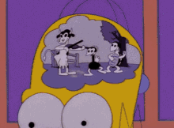
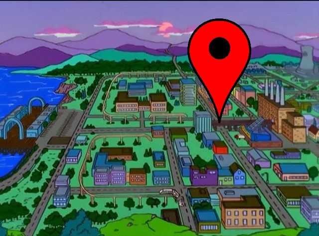
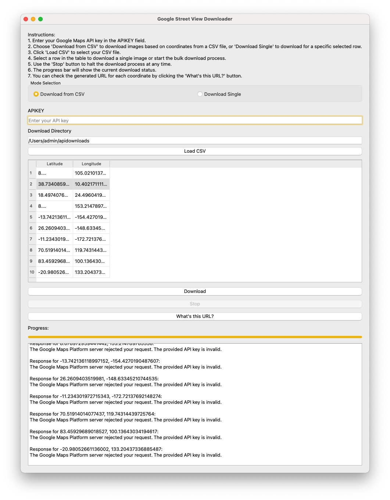
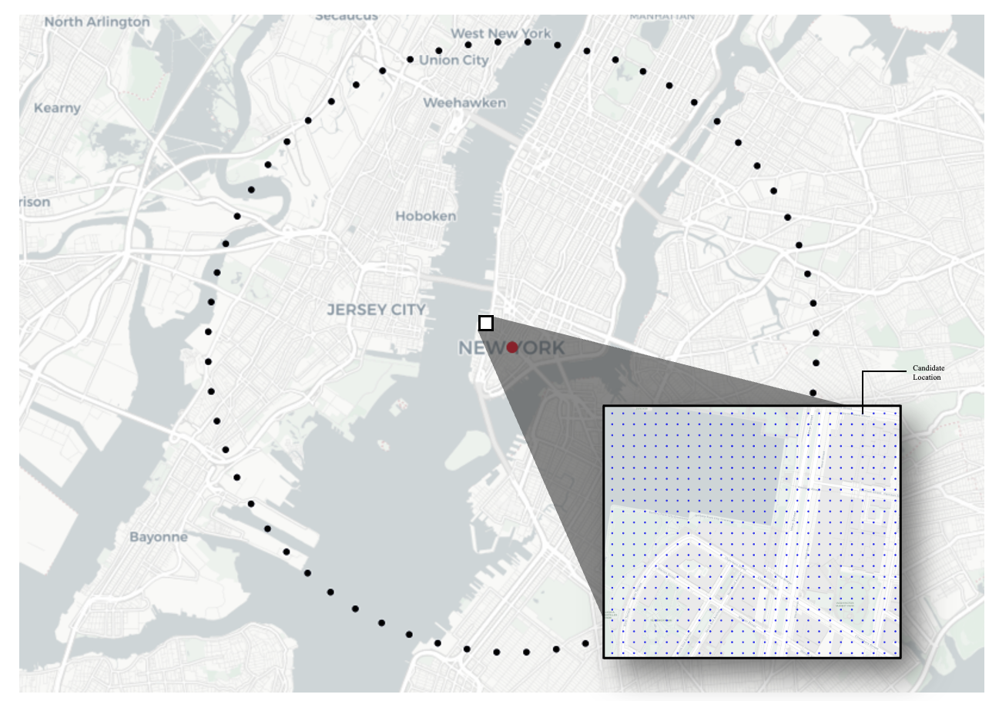

# 🌍 City-scale Geolocation from Street-Level Images using Attention Nets, Object Localization, Colour-Space Embeddings, and Text Extraction 🚀

Welcome to the **Capstone MAI Project** for the **University of Canterbury (2024-2025)**! 🎓 This repo is all about building a *GeoGuessr Bot*... but a supercharged, AI-powered version. More on that in the business section. 📍

This README was mostly generated by **MS Copilot**, based on information from the report and report proposal (both of which are in `/reports`).

#### ⚡️ This README will be updated as the model is finalized. ⚡️

 
   
   
   

 

<em>Image Features -> NN Model -> Output Location</em>

## 📚 Table of Contents
- [Background](#background)
- [Installation and Setup](#installation-and-setup)
- [Usage](#usage)
- [Justifications and Deep Learning](#justifications-and-deep-learning)
- [Features](#features)
- [Contributing](#contributing)
- [License](#license)
- [Authors and Acknowledgments](#authors-and-acknowledgments)
- [Contact Information](#contact-information)

## 🧭 Ever Played GeoGuessr? 🧭

GeoGuessr is an online geography game where you guess locations based on Google Street View images. 🌍 You analyze visual clues like road signs, landmarks, and vegetation to guess where in the world the photo was taken. Players earn points based on how close they are to the actual location. 🏆

This project takes that concept and turns it into a **GeoGuessr Bot**! 🚀 It uses **deep learning** to make geolocation predictions from street-level images. It's like turning **Google Street View** into a giant treasure map, and this bot is your trusty guide! 🗺

---
## The todo section

1. Include yolo and conversion code
2. Include doctor code
3. store the extracted info as it's own tensor (this one is pending actually receving some SSD's from the mail...)
4. The project
5. Overleaf for proj

## 💻 Installation and Setup 💻

**TODO**: We’re still setting up the installation instructions! Stay tuned. 🔧

---

## 🏁 Usage 🏁

**TODO**: Instructions for usage will be added once the model is live! 🚀

---

## 🎨 Features 🎨

**TODO**: Here’s a preview of what’s coming soon:

- 🌍 Geolocation prediction from Google Street View images.
- 🧠 Deep learning model utilizing image features, object detection, and text extraction.
- 🔧 Tools for downloading and processing street view data.

---

## 📝 License 📝

The project is licensed under **[License Name]**. Check the `LICENSE` file for full details.

---

## 👨‍💻 Authors and Acknowledgments 👨‍💻

- **Noah King** - [GitHub Profile](https://github.com/2of)

---

## 📩 Contact Information 📩

For questions or feedback, feel free to reach out via [email](mailto:noah@2of.io) or open an issue here on GitHub! 💬

---

## 🧳 Geolocation? What is that? Locating Rocks? 🧳

Geolocation is the process of identifying the geographical location of a person or device using digital information such as GPS, IP addresses, or Wi-Fi positioning. It’s **super useful** in everyday apps like maps, social media, and even fraud prevention. 🌍

[Learn more about geolocation and its applications here!](https://www.esri.com/en-us/what-is-geolocation) 📚

In this project, we focus on using **image features** from Google Street View images to predict the **latitude and longitude** of a given location. We’re making predictions at a **city scale**, with a model you can train on your own! 🧠

---

## 🎯 What's in the repo? 🎯

This repo has everything you need to build your own **GeoInformer** (or **GeoGuessr Bot**)—just add your own Google Street View API key! Some images for validation are already included in `/data`. 🌎

### 🛠️ Tools:
1. **A GUI tool** to download Google Street View data (API key required) using **QT5**.
   

     
   

2. **A tool to generate evenly distributed geolocation data** for street view images (command-line tool, but here's a preview of how it works):
   

     
   

---

## 🧠 Background and Motivation 🧠

### 📍 Introduction
While many image formats have geolocation data embedded in their metadata, in the absence of this data, we propose a method for determining **geolocation** using **features** derived directly from the image content. 🔍

The popular game **GeoGuessr** gamifies this concept by challenging players to guess locations based on Google Street View images. 🌍 This repo brings that concept into the realm of machine learning. Instead of humans guessing, a **deep learning model** makes predictions on where the image was taken, based on local features in the image.

---

### 🔧 Approach

We’re using **cutting-edge AI techniques** for this project:

- **Object Detection**: Using YOLO for real-time object detection. 🧐
- **Text Extraction**: Leveraging **docTR** for robust text extraction. 📝
- **Color Extraction**: Custom algorithms for **HSV color space analysis**. 🌈

These features are combined into a **GeoLocalization Pattern**, which is passed through an attention model to make more accurate predictions. 🌍

---

## 🌐 Obtaining Data

1. Use the **Graphical Tool** to load and download Google Street View images using a `.csv` of candidate points.
2. The **Point Generator and Refiner** (located in `/tools`) can help you generate and refine the locations for downloading.
3. Set your root **LAT/LONG** in the `/config` file to define the center of the data area.
4. A critical concept: **Recency** matters—images taken at different times from the same location are included in the dataset. 🕒

---

## 🧑‍💻 Pipeline

The pipeline consists of three primary branches:

1. **Color Evaluation**: Extracts color histograms from images and creates a color embedding. 🌈
2. **OCR Text Extraction**: Uses **docTR** OCR to extract text, which is then embedded. 📝
3. **Object Detection**: Detects objects using YOLO and generates object embeddings. 🏙️

All features are combined and processed through an **attention layer** to improve the geoinformative power of the model. 🧠

---

### 🧬 Architecture and Activation Functions

The model processes **640 x 640** input images and uses YOLOv11 and docTR for object detection and text recognition. The embeddings from these branches are combined before passing through the attention layer to make predictions.

We use **activation functions** like ReLU and Leaky ReLU to ensure effective learning in this deep architecture. ⚡

---

### 🎨 Color Histogram Embedding

We process the image to extract **HSV** histograms representing the color distribution. These histograms are turned into a vector, which is then used as an input to the neural network for better location prediction. 🌈

---

### 📝 Text Extraction and Processing

Text is a **critical geolocator** in this project! We use **docTR** for **OCR** to extract text from images. This process helps the model identify locations based on **street names, signs**, and other text-based clues. 🛣️

---

TODO: FINISH THIS

*I asked an LLM to add emojis to this, I've noticed it's gone hard on the language too. Oh well :) It's fun, I guess?*
